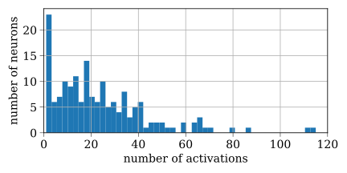
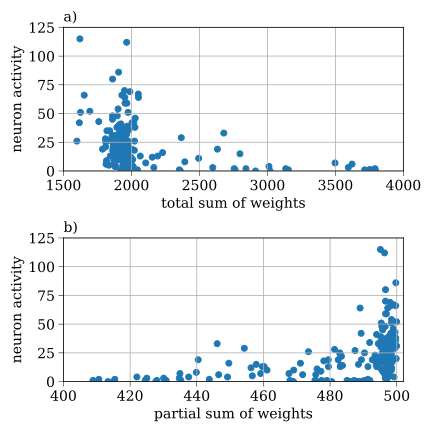

# __Knowledge fusion in spiking neural networks by pruning__
***   
The code illustrates the result reported at the [ITNT-2022](https://itnt-conf.org/index.php/en/layout/left-main) conference and published in [IEEE Xplore](https://ieeexplore.ieee.org/document/9848660).

### __ARTICLE:__     

D. Antonov and S. Sukhov, "Knowledge fusion by pruning in spiking neural networks," 2022 VIII International Conference on Information Technology and Nanotechnology (ITNT), Samara, Russian Federation, 2022, pp. 1-6, doi: 10.1109/ITNT55410.2022.9848660.
***   
Abstract: Multitask learning is critical for the development of artificial general intelligence. Unfortunately, sequential learning of several tasks in artificial neural networks (ANNs) often results in catastrophic forgetting of previous knowledge. We propose a method of multitask learning based on the knowledge fusion of two ANNs. The method assumes pruning unessential weights in one ANN and replacing them with the weights of another network. This procedure makes it possible for the resulting network to have multitasked abilities. The proposed method does not require previous training data. The method is tested on convolutional spiking neural networks (SNNs) in image classification tasks. The experiments are performed on freely available datasets in the [SpykeTorch](https://github.com/miladmozafari/SpykeTorch) simulation framework.
***
__The code is written in Python 3.8 using the [SpykeTorch](https://github.com/miladmozafari/SpykeTorch) framework__
***  
How can we overcome catastrophic forgetting?    

Train one SNN to learn one thing (for example, to recognize the number 1, as in the Figure below), and another SNN to learn another thing (to recognize the number 5), and then merge the knowledge of the two SNNs into a single SNN (which will recognize both 1 and 5):   

    

__The Essence of the Method__    

Our intention is to fuse SNN1 and SNN2 by pruning technique. In both networks, SNN1 and SNN2, in their outer layer, we rank the neurons with respect to their importance (the criterion for importance will be defined later). The half of the least important neurons are pruned together with incoming weights. The most important neurons with corresponding weights from SNN1, SNN2 are combined into fused SNN. As a result, we obtain a network that is able to classify the items of both datasets; the size (the number of parameters) in the fused SNN remains the same as in original networks SNN1, SNN2.    

The first criterion for the importance of a neuron is its __activity__:     
- if the neuron does not participate in the classification of data, it is deemed to be unimportant,     
- if the neuron shows high activity (often generates spikes) during classification, it is believed to be important.     

__Figure:__ Histogram of activations of output neurons in SNN during testing; there are few active neurons, they are located on the right side of the histogram.    

One can relate __the importance of a particular neuron__ to the sum of all the weights converging to this neuron, but this hypothesis is not confirmed in SNNs (Fig.a below). Instead of summing the magnitudes of all the weights converging to the particular neuron, we __sum only 10% of the largest weights__ (Fig.b below). The neurons of each of the classes are ranked with respect to the magnitudes of the partial sums. Half of the neurons with the lowest magnitude of partial sums are pruned in both SNN1 and SNN2. The remaining neurons and corresponding weights are fused into one network, the fused network acquires the ability to classify data from both Dataset 1 and Dataset 2.     
__This approach does not require access to the training data__.    

__Figure:__ Activity of a neuron in the output layer of SNN as a function of complete sum of incoming weights (a), as a function of partial sum of incoming weights (b).

***
***

